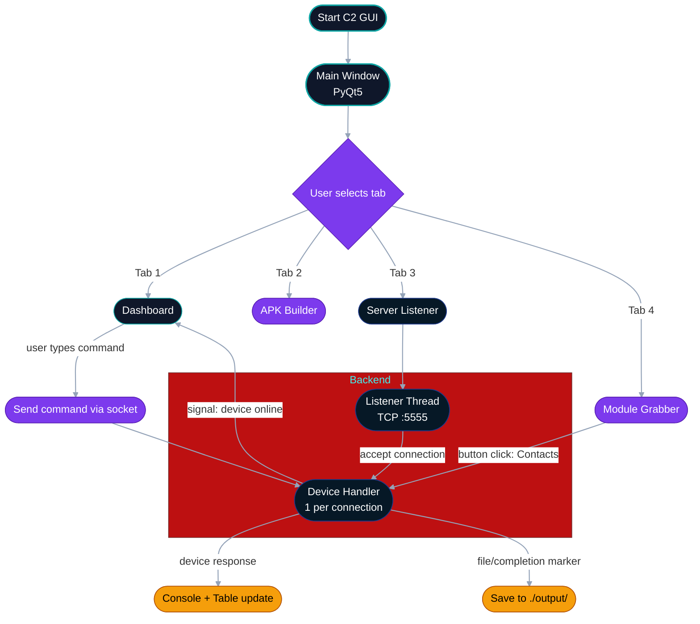

# C2 Server Architecture

## Overview

The command-and-control server is presented in the portfolio as a research prototype with a graphical interface, device-session management, and a networking backend. The public documentation focuses on how the system is organized and what it demonstrates, not on implementation details.

## High-Level Structure

The application is organized around three layers:

- A user-facing dashboard for viewing device status and interacting with sessions.
- A control layer that routes actions between the interface and the backend.
- A networking layer that handles connection management and data exchange.

This separation makes the project easier to explain in a portfolio setting and highlights the difference between the visual control surface and the underlying communications layer.

## Interface Areas

### Dashboard

The dashboard is the main operator view. It shows which devices are connected, the current session state, and the available actions. The dashboard is the clearest place to demonstrate that the project is active and not just conceptual.

### Build and Configuration Area

A separate section of the interface is used for project setup and environment configuration. In the public version of the portfolio, this section is described only as a control area for preparing the research prototype.

### Server and Listener Area

This section presents the state of the listener and the current connection activity. It is useful for showing that the project manages multiple device sessions and keeps track of live communication.

### Grabber and Export Area

This section groups the data-oriented functions of the project. It demonstrates that the system can collect and organize different categories of information in the lab environment.

## Networking Model

The backend uses a persistent client-server model. Devices connect back to the control application, the server tracks session state, and the interface updates as connections change. The architecture is designed to support real-time interaction, file transfer, and task routing.

For public documentation, the important point is the design pattern: the control server is responsible for coordinating many sessions, while the device side is responsible for carrying out requests and returning results.

## Threading and Responsiveness

The architecture uses background processing so the interface remains responsive while network sessions are active. This is a common pattern in GUI-driven systems, and it allows the dashboard to remain usable while communication continues in the background.

## Data Handling

The system distinguishes between text-oriented session output and file-oriented results. The portfolio describes this as a data-routing problem rather than as a collection of code paths. That framing keeps the document useful for architecture review without turning it into a build guide.

## Why This Architecture Matters

The value of this section is in showing how a security research prototype can be structured as a complete application. It demonstrates software organization, concurrent session handling, and clear separation between interface, control, and transport layers.

## Safe Public Summary

This document shows the control-plane architecture of the research prototype at a level suitable for a public portfolio. It intentionally avoids code, exact protocol details, and operational instructions.
## Diagram

Inline Mermaid diagram (sanitized) showing the C2 GUI, backend listener, and device handlers.

Notes:

- Diagram labels and punctuation were simplified to improve compatibility with GitHub's Mermaid renderer.
