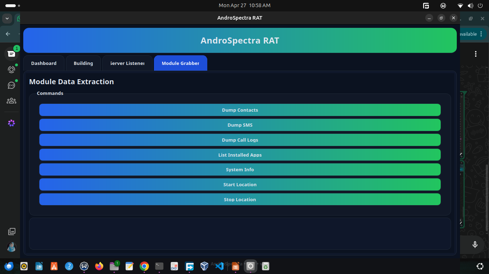
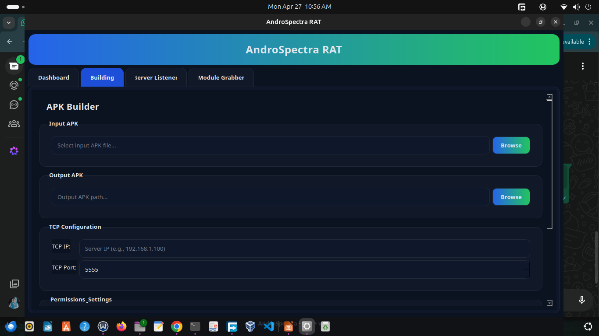
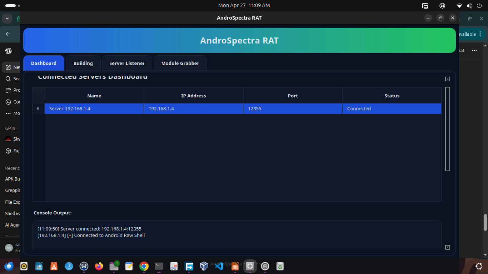
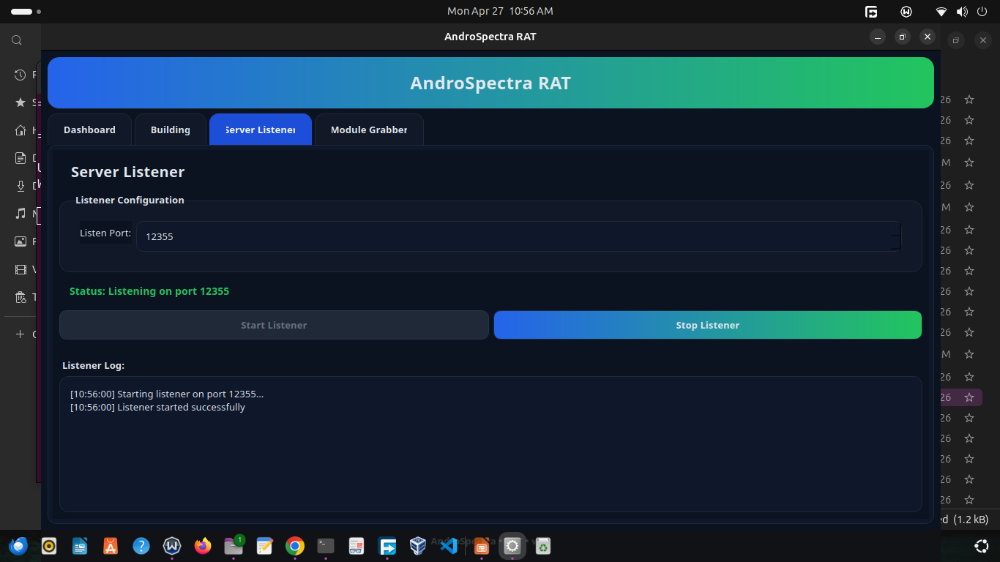
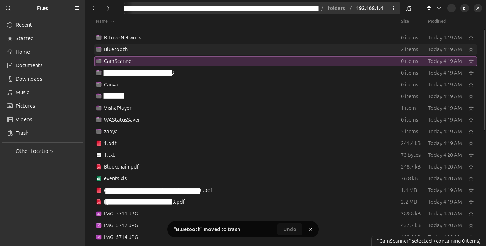
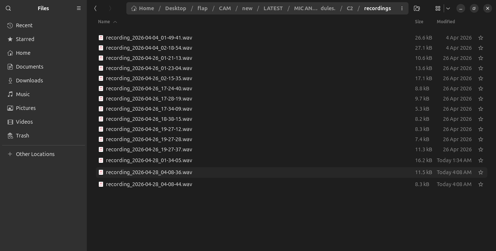
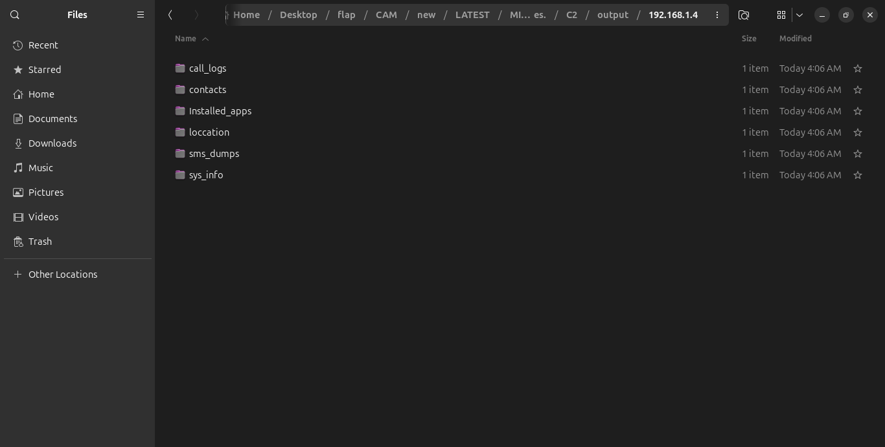
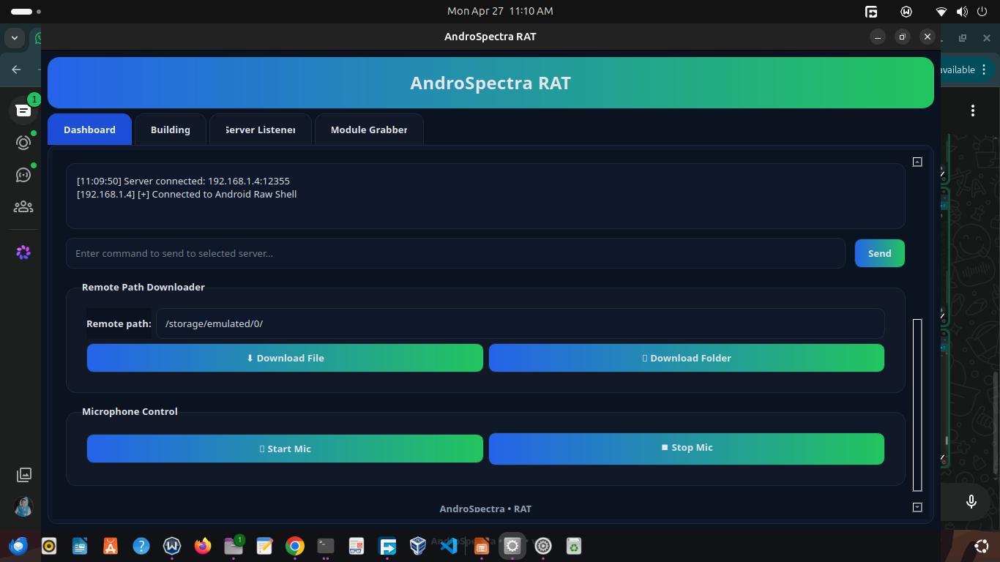

# AndroSpectra Demo

This page is the public-facing demo for the portfolio. It keeps the evidence in one place, explains what each screenshot shows, and avoids any build steps, code, or operational instructions.

**Architecture diagrams:** high-level visuals live in the repository `architecture/` folder — [C2 overview](../architecture/C2.md) and [RAT lifecycle](../architecture/RAT.md).

The screenshots below are from a controlled lab setup used for academic research. They are included to document what the project does at a high level and to support discussion in interviews, reviews, or academic presentations.

## What the demo shows

- A working project dashboard
- A build/configuration view for the research prototype
- A live device session in a lab environment
- A server/status view for connectivity
- A file-browsing and capture workflow
- An audio capture result view
- A module/status overview
- A session console view

## Screenshot Gallery

### 1. Project overview

Shows the full project dashboard and the breadth of the research prototype in one view.

### 2. Builder interface

Shows the project’s configuration and build panel used during the lab demonstration.

### 3. Connected device

Shows a lab device connected and responding in the demo environment.

### 4. Server listener

Shows the server-side connection monitor and activity log for the session.

### 5. File browser view

Shows the file access and export view used to demonstrate data handling in the research setup.

### 6. Audio capture view

Shows the captured audio output from the controlled demonstration.

### 7. Module dashboard

Shows the module list and status summary for the project.

### 8. Session console

Shows the active session console used in the lab demonstration.

## Ethical boundary

This portfolio is presented as research documentation only. It does not include source code, APKs, build scripts, or step-by-step instructions for recreating the project.

## What to say about it

If someone reviews this portfolio, the safe summary is simple: it is an academic security research project that demonstrates how a mobile threat can be observed, documented, and explained without publishing the implementation.
